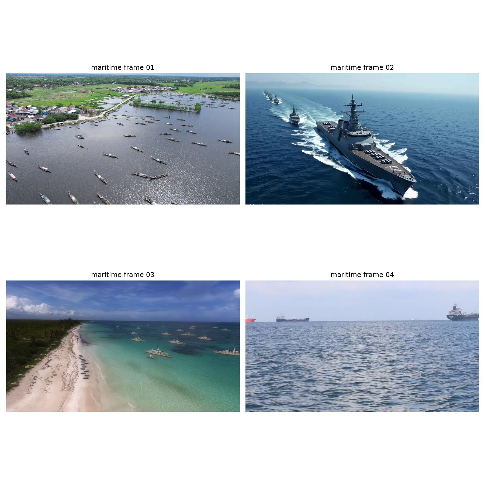
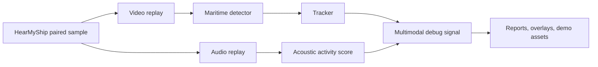
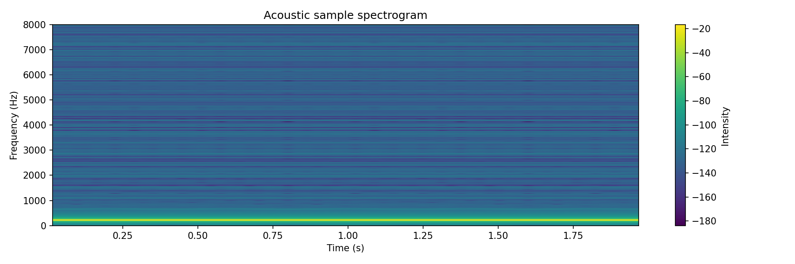

# Maritime Perception Replay Bench

## One-line summary

A ROS2-based replay and debugging bench for maritime perception workflows.

## Project at a glance

This project is a **maritime perception replay and debugging bench**. It is not presented as a production autonomy stack. The practical goal is narrower and useful: take recorded maritime video/audio, replay it through a ROS2 graph, run detection/tracking/acoustic activity, inject faults, collect metrics, and package artifacts so a perception failure can be reproduced and improved later.

<p align="center">
  
</p>

### What problem it solves

Maritime perception systems often fail in boring but expensive ways: small vessels, glare, wake, horizon clutter, camera/audio timing drift, dropped frames, stale detections, and models that look good on one dataset but fail on another. This repo gives a repeatable way to test those cases instead of only watching a detector window and guessing what happened.

### Current demo story



The current demo uses a small local HearMyShip sample, a YOLO detector first trained on the Singapore Maritime Dataset and then fine-tuned on HearMyShip frames, plus an acoustic activity lane from the paired WAV sample.

<p align="center">
  
</p>

### Why this is not just a Python detection script

A single Python script is better for making a clean video overlay. This repo keeps ROS2 because the engineering problem is bigger than drawing a box:

| Need | Why the bench exists |
|---|---|
| Replay | Test the same scene again after changing detector, tracker, thresholds, or sync logic. |
| Metrics | Measure FPS, latency, p50/p95 timing, active tracks, and failure modes. |
| Fault injection | Stress the pipeline with blur, glare, delay, jitter, dropped frames, compression, and noise. |
| Multimodal debugging | Compare what visual tracking says with acoustic activity from the paired sample. |
| Artifact packaging | Save configs, manifests, reports, and model/run metadata so results are reproducible. |
| Deployment path | Keep the same topic-level architecture for offline replay, OAK camera ingestion, and future live tests. |

For public README/demo media, a deterministic offline renderer can be used to make a clean frame-aligned GIF/MP4 from the same model, manifest, video, and audio. The ROS2 graph remains the validation and debugging system.

### Current status

- Working ROS2 replay path for paired video/audio samples.
- Working detector/tracker/overlay topics for the HearMyShip demo sample.
- Working acoustic activity score and fusion debug topic.
- Working benchmark/failure-report artifact flow.
- Demo detector is **domain-adapted for the current HearMyShip sample**, not claimed as a universal maritime detector.
- CPU-only ROS inference can lag visually; for polished videos, render offline from the same inputs.

## Why this exists

This project explores the engineering workflow behind perception systems for maritime field tests: replay, detection, tracking, runtime metrics, fault injection, annotation mining, edge profiling, live OAK camera ingest, and reproducible artifact packaging.

The goal is not to claim production accuracy. The goal is to build a practical testbed for understanding how perception pipelines behave under replay, degraded inputs, live sensor timing, and data-loop pressure.

## What it is

Maritime Perception Replay Bench is a prototype ROS2 workspace and tooling layer that includes:

- a replay-oriented perception pipeline;
- object detection and IOU-based tracking;
- runtime, timing, queue, and latency metrics;
- visual and temporal fault injection;
- clean-versus-degraded robustness benchmarking;
- ONNX Runtime and OpenVINO edge profiling scripts;
- live OAK camera ingest through the same perception stack;
- annotation mining for uncertain frames and unstable tracks;
- COCO/JSON and CVAT-ready export utilities;
- local artifact bundles with run manifests;
- optional MinIO upload as a local S3-style artifact mirror.

## What it is not

This project is not:

- an operational maritime autonomy system;
- validated on real harbor trials;
- a production detector;
- a claim of benchmark-leading model accuracy;
- a safety-certified perception stack;
- a defense product;
- a replacement for field testing, labeling QA, or deployment validation.

The OAK live path is a hardware-in-the-loop smoke test. It proves that the live camera stream can enter the same ROS2 perception, metrics, and debugging stack as replay. It does not prove maritime performance.

## Architecture overview

The current pipeline is organized around a few practical loops:

1. **Replay and perception loop**
   Replay or live images feed detection, tracking, overlays, water-prior filtering, and metrics.

2. **Robustness loop**
   Fault injectors simulate frame drops, blur, compression, glare, noise, delay, and jitter.

3. **Edge profiling loop**
   Scripts compare PyTorch, ONNX Runtime, and OpenVINO latency/FPS behavior.

4. **Annotation loop**
   Miners select uncertain frames and unstable tracks, then export them to reviewable formats.

5. **Artifact loop**
   Run bundles collect configs, reports, predictions, models, screenshots, bags, manifests, and optional MinIO upload metadata.

## Quickstart

From a configured Ubuntu 24.04 + ROS2 Jazzy environment:

```bash
cd maritime-perception-replay-bench

source /opt/ros/jazzy/setup.bash
source .venv/bin/activate

cd ros2_ws
python -m colcon build --symlink-install
source install/setup.bash
cd ..
```

Run a clean replay/debugging workflow:

```bash
make run-clean
```

Run robustness benchmarks:

```bash
make benchmark-robustness
make robustness-report
```

Run edge profiling if the model and sample frames are available:

```bash
make bench-onnx
make bench-openvino
make compare-runtimes
```

Run live OAK smoke test if hardware is connected:

```bash
make oak-live
```

Mine and export annotation candidates:

```bash
make mine-uncertain
make mine-unstable
make export-annotation
```

Package a local run artifact bundle:

```bash
make package-run
```

## Main capabilities

### Replay and perception

The project uses ROS2 launch files and custom packages to run detection, tracking, overlays, water-prior filtering, and metrics in a repeatable way.

### Metrics and observability

The metrics stack tracks runtime FPS, active tracks, estimated dropped frames, end-to-end latency, detector latency, timing skew, and queue delay. Debug layouts are included for RViz and Foxglove-style inspection.

### Fault injection

Fault injection nodes simulate degraded visual or temporal conditions:

- frame drop;
- blur;
- compression artifacts;
- glare;
- noise;
- artificial delay;
- jitter.

These are used to compare clean and degraded behavior under controlled scenarios.

### Edge profiling

The project includes scripts for ONNX Runtime, OpenVINO, and runtime comparison. The point is to reason about deployment tradeoffs using p50/p95 latency and FPS, not just average speed.

### Live OAK path

The OAK camera path uses DepthAI and publishes live RGB frames into the same ROS2 perception stack. This validates integration and timing behavior, not field performance.

### Annotation mining

The annotation mining workflow finds:

- uncertain frames;
- low-confidence detections;
- small objects;
- frames with many detections;
- unstable tracks;
- missed-frame track events;
- short-lived or fragmented track behavior.

Mined samples can be exported to COCO/JSON or a CVAT-ready review folder while preserving model confidence, timestamps, source paths, mining reason, and track metadata.

### Artifact registry

Run bundles are stored locally under ignored artifact directories and can include:

- config files;
- bags;
- metrics;
- predictions;
- screenshots;
- models;
- reports;
- run manifests;
- optional MinIO upload manifests.

The key idea is lineage: benchmark numbers and field-debugging results should be traceable to code, config, model, scenario, and machine context.

## Repository map

```text
configs/                         YAML configs and project notes
docker/                          optional local MinIO compose file
foxglove/layouts/                 debugging layouts
rviz/                             RViz debug layout
ros2_ws/src/                      ROS2 packages
scripts/                          benchmark, export, artifact, and utility scripts
schemas/                          JSON schemas for run manifests
```

Generated reports, models, local artifacts, bags, screenshots, caches, and MinIO data are intentionally ignored by Git.

## Important commands

```bash
make run-clean
make run-dropframes
make run-blur
make run-delay
make run-glare
make benchmark-robustness
make robustness-report
make bench-onnx
make bench-openvino
make compare-runtimes
make oak-live
make mine-uncertain
make mine-unstable
make export-annotation
make package-run
make minio-up
make minio-upload
make minio-down
```

## Engineering scope

This project covers the practical infrastructure around a perception pipeline:

- repeatable replay;
- live sensor integration;
- runtime instrumentation;
- controlled fault injection;
- latency and FPS profiling;
- failure mining;
- annotation export;
- artifact lineage;
- reproducible setup and run documentation.

The focus is the workflow around shipping and debugging perception systems: being able to replay data, inject failures, measure runtime behavior, inspect live sensor timing, select useful samples for review, and preserve enough run metadata to reproduce results later.

The project does not treat one detector checkpoint as the product. The detector is one component inside a larger loop for debugging, profiling, data selection, and artifact traceability.

## Project positioning

This is a prototype testbed for perception workflow development. It is useful for validating integration paths, comparing runtime behavior, exercising failure cases, and building a repeatable data-review loop.

It should be read as an engineering bench rather than a finished application. The strongest part of the project is the end-to-end workflow: replay or live input, perception nodes, metrics, failure injection, annotation mining, exports, and run manifests.

## Limitations

Current limitations include:

- no real harbor-trial validation;
- no claim of production accuracy;
- no safety certification;
- no calibrated maritime dataset release;
- OAK live testing has been used as an integration smoke test;
- depth is not yet part of the core pipeline;
- acoustic processing is currently a prototype lane;
- MinIO upload is optional and local-first;
- generated artifacts are ignored and must be regenerated locally.


## Next steps

Possible next steps:

- stronger architecture diagram and demo script;
- benchmark summary and failure analysis;
- acoustic classifier lane;
- AIS/context fusion;
- better field-data ingestion workflow;
- improved labeling QA;
- deployment hardening for ONNX/OpenVINO;
- long-running live sensor stability tests.
